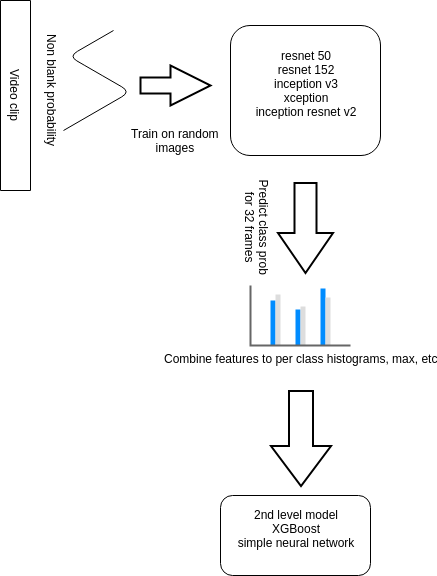

# The first place winning solution for the Pri-Matrix drivendata competition.

## Description



1. Fine-tuned multiple ImageNet pre-trained convolutional neural networks on randomly
selected frames from video clips using stratified 4 folds split
2. Predicted classes for 32 frames per clip and combined predictions in a way time specific
information is dropped and only combined prediction statistics used.
3. Trained the second level models (xgboost, neural network, lightgbm) on out of fold CNN
model predictions.

I used following features for xgboost network:

* Mean, median, min, max, 10 and 90 percentiles of predicted class probability
* Histogram of predicted class probability, 10 bins

For neural network, for each class I sorted individual class predictions over 32 frames and
“downsampled” it 4 times (I took mean of 4 lowest values, values from 5 to 8, etc).
The results from either pre-processing were comparable, I decided to use histogram for xgboost
and sorted downsampled scores for a simple 2 layer fully connected neural network.

While I partially rebalanced classes during L1 models training, I kept the original classes
distribution for L2 models to keep it closer to expected test data distribution.


### Requirements:

Linux (tested on Ubuntu 17.04 with python 3.6 installed),
python 3.6
ffmpeg, may be necessary to install dev packetas as well for building python packets:
sudo apt install ffmpeg libavformat-dev libavcodec-dev libavdevice-dev libavfilter-dev libswscale-dev libavresample-dev
It's also necessary to install cuda8 for tensorflow 1.4

python dependencies are listed in requirements.txt


### Prepare input files:

test video clips should be extracted to input/raw directory
decoded frames are stored to /opt/data\_fast/pri\_matrix/train\_img
but this directory can be chaged in config.py and convert\_all\_img.sh
ssd drive is reecommended for this directory with approx 250-300GB free space

```
bash prepare_input_data.sh

cd src
bash train.sh
bash predict.sh
```

Notes:
when done sequentially, prediction would take a lot of time.
all the calls like
python3.6 single\_frame\_cnn.py generate\_prediction\_test 
in predict.sh are independent and can be run on different GPUs or different computers.

It's necessary to collect generated output/prediction\_test\_frames before running the second stage scripts

